"Got Git"

part 1: Meet Git
###################

Chapter 1: Version Control History
***********************************

1.1       The Dark Age                              [1]
=======================================================

The dark age wasn't so dark, there were `diff` and `patch` at least. In this section, diff and patch will be introduced by examples.

1.2       CVS -- Leads to SCM explosion             [4]
=======================================================

CVS history and CVS implement model.

  .. figure:: images/en/fig-01-01-cvs-arch.png
     :scale: 70

     Fig 1-1

1.3       SVN -- A superior central SCM             [6]
=======================================================

SVN history and SVN implement model.

  .. figure:: images/en/fig-01-02-svn-arch.png
     :scale: 70

     Fig 1-2

1.4       Git -- Linus second masterpiece           [9]
=======================================================

Git history.

Chapter 2: Fall in love with Git
***********************************

Git hightlights by examples.

2.1       Everyday's works backup                  [11]
=======================================================

How I backup eachday's work using Git and mirroring when I work on this book.

  .. figure:: images/en/fig-02-01-work-backup.png
     :scale: 65

     Fig 2-1

2.2       Works with others at diff. location      [12]
=======================================================

How I synchoronize works in different locations, home and office, when I work on this book.

  .. figure:: images/en/fig-02-02-workflow.png
     :scale: 65

     Fig 2-2

2.3       On Site version control                  [13]
=======================================================

2.4       No control dir everywhere                [15]
=======================================================

one single .git directory, comparing with SVN's .svn in each subdirs.

git grep.

2.5       Rewrite commit log                       [16]
=======================================================

git commit --amend.

2.6       Regrets                                  [16]
=======================================================

git reset and git rebase -i.

2.7       Better change sets                       [17]
=======================================================

Stage works like commit change set.

2.8       Better differences                       [18]
=======================================================

git diff --cached.

2.9       Save work progess                        [19]
=======================================================

git stash.

2.10      Commit while traveling with git-svn      [20]
=======================================================

git-svn, nobody knows your commit throught git.

2.11      Pager everywhere                         [20]
=======================================================

no longer need PIPE LESS ( `| less` ) after commands.

2.12      Fast                                     [21]
=======================================================

smart protocol.

Chapter 3: Install Git
**************************

3.1       Install Git under Linux                  [23]
=======================================================

3.1.1        Install using pkg mgmt system         [23]
-------------------------------------------------------

3.1.2        Install from source code.             [24]
-------------------------------------------------------

3.1.3        Install from Git repository           [25]
-------------------------------------------------------

3.1.4        Bash completion                       [26]
-------------------------------------------------------

3.1.5        Chinese character support             [26]
-------------------------------------------------------

Works excellently in UTF8 environment, but may failed in other locale.

* Logs works fine because there is a embed charset encoding directive in commit object.
* Filenames with local characters failed, because tree object not encode in UTF8.

3.2       Install Git under Mac OS X               [28]
=======================================================

3.2.1        Install from binary package           [28]
-------------------------------------------------------

3.2.2        Install Xcode.                        [29]
-------------------------------------------------------

No need to download Xcode, there is a copy in Mac OS installer DVD.

  .. figure:: images/en/fig-03-03-xcode-install.png
     :scale: 65

     Fig 3-3

3.2.3        Install using Homebrew                [30]
-------------------------------------------------------

3.2.4        Install from Git repository           [31]
-------------------------------------------------------

3.2.5        Bash completion                       [32]
-------------------------------------------------------

3.2.6        Install other utils                   [32]
-------------------------------------------------------

3.2.7        Chinese chacter support               [33]
-------------------------------------------------------

Works fine just like in linux with UTF8 locale.

3.3       Install Git under Windows Cygwin         [33]
=======================================================

3.3.1        Install Cygwin.                       [34]
-------------------------------------------------------

If has low bandwith (like me), setup a cygwin mirror using apt-cacher-ng in Debian can be helpful.

  .. figure:: images/en/fig-03-07-cygwin-5-mirror.png
     :scale: 100

     Fig 3-7

3.3.2        Install Git                           [40]
-------------------------------------------------------

How to use cygwin package management progrem (setup.exe) --- find and install git.

  .. figure:: images/en/fig-03-13-cygwin-8-search-git-install.png
     :scale: 100

     Fig 3-13

3.3.3        Cygwin configuration and usage        [42]
-------------------------------------------------------

3.3.4        Chinese support for Cygwin Git        [44]
-------------------------------------------------------

Works fine just like in linux with UTF8 locale.

3.3.5        SSH access for Cygwin Git             [45]
-------------------------------------------------------

Current cygwin's ssh not works at some situation, so I introduce how to integrate pytty's plink and pagent.

3.4       Install Git under Windows msysGit        [51]
=======================================================

3.4.1        Install msysGit                       [51]
-------------------------------------------------------

3.4.2        msysGit configuration and usage       [54]
-------------------------------------------------------

3.4.3        Chinese in msysGit shell              [55]
-------------------------------------------------------

3.4.4        Chinese support for msysGit           [57]
-------------------------------------------------------

Bad support.

* Logs may work if setting i18n.commitEncoding, i18n.logOutputEncoding, but some other tools linke TortoiseGit can not show log properly. 
* Filenames can not use Chinese, because characters in tree object are encode in zh_CN.GBK, not UTF-8.

3.4.5        Using SSH protocol                    [58]
-------------------------------------------------------

3.4.6        TortoiseGit Installation and usage    [58]
-------------------------------------------------------

3.4.7        Chinese support for TortoiseGit       [62]
-------------------------------------------------------

As bad as msysGit, and log process not compatible with msysGit.

Part 2: Git Solo
####################################

Play with Git one person, so I call this part: Git solo.

Chapter 4: Git Initial
***********************************

4.1       Repository initial and the first commit  [63]
=======================================================

git init, git add, git commit...

4.2       Think: why there is a .git directory?    [66]
=======================================================

Compare with CVS's CVS, SVN's .svn, StarTeam's server-side track implementations.

4.3       Think: different git config level        [69]
=======================================================

Run `git config --system -e` to see where is your system config file is.

4.4       Think: who is commiting?                 [71]
=======================================================

4.5       Think: change name freely, is it safe?   [73]
=======================================================

Shouldn't change user.name and user.email frequently.
For example Redmine may break if change username which break users map between Git and remdine.

  .. figure:: images/en/fig-04-01-redmine-user-config.png
     :scale: 60

     Fig 4-1

Another example is Gerrit.

4.6       Think: what is command alias?            [75]
=======================================================

4.7       Backup this chapter's work               [76]
=======================================================

Chapter 5: Git Stage
***********************************

5.1       Why modifications not commit directly?   [77]
=======================================================

5.2       Unstand Git Stage                        [83]
=======================================================

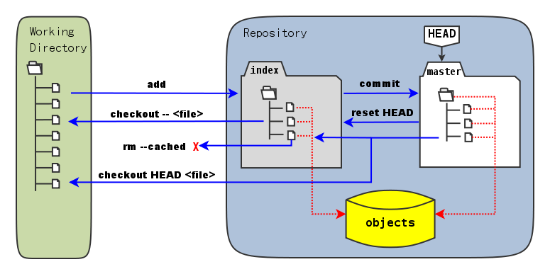

   Fig 5-1

5.3       Magic in Git Diff                        [86]
=======================================================

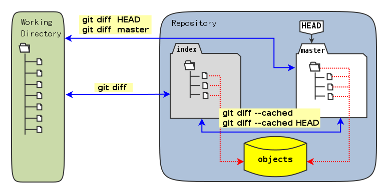

   Fig 5-2

5.4       Do not use git commit -a                 [90]
=======================================================

5.5       I'll be back                             [90]
=======================================================

git stage save.

Chapter 6: Git Objects
***********************************

6.1       Git object exploration                   [92]
=======================================================

Object database:

  .. figure:: images/en/fig-06-01-git-objects.png
     :scale: 90

     Fig 6-1

Git implement detail:

  .. figure:: images/en/fig-06-02-git-repos-detail.png
     :scale: 90

     Fig 6-2

6.2       Think: What is SHA1, how it generate?    [98]
=======================================================

6.3       Think：commit ID not a series of num?   [100]
=======================================================

Chapter 7: Git Reset
***********************************

7.1       Mystery of branch cursor                [103]
=======================================================

How git reset affect branch, index and working directory.

  .. figure:: images/en/fig-07-01-git-reset.png
     :scale: 80

     Fig 7-1

7.2       Save bad reset using reflog             [105]
=======================================================

7.3       Deep into git reset                     [107]
=======================================================

Chapter 8: Git Checkout
***********************************

8.1       Checkout is HEAD reset                  [110]
=======================================================

How git checkout affect HEAD, index, and working directory.

  .. figure:: images/en/fig-08-01-git-checkout.png
     :scale: 80

     Fig 8-1

8.2       Detached HEAD                           [113]
=======================================================

8.3       Deep into git checkout                  [114]
=======================================================

Chapter 9: Restore Work Progress
***********************************

9.1       Be back                                 [117]
=======================================================

9.2       Using git stash                         [120]
=======================================================

9.3       Mystery in git stash                    [121]
=======================================================

Chapter 10: Git Basic Operation
***********************************

10.1      Take a photo first                      [128]
=======================================================

Take photo using git tg.

10.2      Delete files                            [128]
=======================================================

10.2.1      Local delete is not real delete       [129]
-------------------------------------------------------

10.2.2      Delete using git rm                   [130]
-------------------------------------------------------

10.2.3      Mark delete using git add -u          [131]
-------------------------------------------------------

10.3      Rollback deleted files                  [132]
=======================================================

10.4      Move files                              [133]
=======================================================

10.5      A Hello World with version              [135]
=======================================================

10.6      Add interactive: git add -i             [137]
=======================================================

10.7      Hello world new problem                 [140]
=======================================================

10.8      File ignore                             [141]
=======================================================

Chapter 11: Travel in Git History
***********************************

11.1      gitk                                    [146]
=======================================================

11.2      gitg                                    [147]
=======================================================

11.3      qgit                                    [153]
=======================================================

11.4      Command line tools                      [158]
=======================================================

Following sections in this part using this Git repository: git://github.com/ossxp-com/gitdemo-commit-tree.git

View this git repository using gitg.

  .. figure:: images/en/fig-11-19-gitg-demo-commit-tree.png
     :scale: 80

     Fig 11-19

A nice commit tree of this git repository.

  .. figure:: images/en/fig-11-20-commit-tree.png
     :scale: 100

     Fig 11-20

11.4.1      Revision presentation：git rev-parse  [160]
-------------------------------------------------------

Mark the commit tree with shor commit ID, which is convenient for git rev-parse and git rev-list.

  .. figure:: images/en/fig-11-21-commit-tree-with-id.png
     :scale: 100

     Fig 11-21

11.4.2      Revision list：git rev-list           [163]
-------------------------------------------------------

11.4.3      Log browse：git log                   [166]
-------------------------------------------------------

11.4.4      Show difference：git diff             [170]
-------------------------------------------------------

11.4.5      git blame                             [171]
-------------------------------------------------------

11.4.6      git bisect                            [172]
-------------------------------------------------------

Mark the commit tree with color for git bisect research. Note: red is bad, blue is good.

  .. figure:: images/en/fig-11-22-commit-tree-bisect.png
     :scale: 100

     Fig 11-22

11.4.7      Get revison copy                      [177]
-------------------------------------------------------

Chapter 12: Change History
***********************************

12.1      One Step Regret                         [178]
=======================================================

12.2      Multiple steps regret                   [181]
=======================================================

12.3      Back to future                          [182]
=======================================================

"Back to future" is my favorite movie.This section I will show side effect when change history, and how to change history using 3 different ways.

  .. figure:: images/en/fig-12-01-back-to-future.png
     :scale: 60

     Fig 12-1

This section have 3 part, and each part has 2 scene.

* The current history:

  .. figure:: images/en/fig-12-02-git-rebase-orig.png
     :scale: 100

     Fig 12-2

* Scene 1: change history (throw awy bad commit : D) like the following using one type of time machine.

  .. figure:: images/en/fig-12-03-git-rebase-c.png
     :scale: 100

     Fig 12-3

* Scene 2: change history (merge commits C and D) like the following using one type of time machine.

  .. figure:: images/en/fig-12-04-git-rebase-cd.png
     :scale: 100

     Fig 12-4

12.3.1      Time machine v1                       [184]
-------------------------------------------------------

The first type of time machine is `git cherry-pick` :

* After scene 1, the history is like:

  .. figure:: images/en/fig-12-05-git-rebase-graph.png
     :scale: 80

     Fig 12-5

* After scene 2, the history is like:

  .. figure:: images/en/fig-12-06-git-rebase-graph-gitk.png
     :scale: 90

     Fig 12-6

12.3.2      Time machine v2                       [189]
-------------------------------------------------------

The second type of time machine is `git rebase`.

12.3.3      Time machine v3                       [194]
-------------------------------------------------------

The second type of time machine is `git rebase -i`.

12.4      Throw away history                      [198]
=======================================================

Throw away history using `git commit-tree` and `git rebase`.

After throw away commits before commit A:

  .. figure:: images/en/fig-12-07-git-rebase-purge-history-graph.png
     :scale: 90

     Fig 12-7

12.5      Revert commit                           [200]
=======================================================

Chapter 13: Git Clone
***********************************

13.1      Eggs in different baskets               [203]
=======================================================

Don't put eggs in one basket. Multiple baskets for git are like `git clone`.

  .. figure:: images/en/fig-13-01-git-clone-pull-push.png
     :scale: 100

     Fig 13-1

13.2      Neighborhood workspace                  [204]
=======================================================

Exchange data between neighborhook workspace.

  .. figure:: images/en/fig-13-02-git-clone-1.png
     :scale: 100

     Fig 13-2

13.3      Bare repository from clone              [208]
=======================================================

Clone as a bare repository, then exchange data with it.

  .. figure:: images/en/fig-13-03-git-clone-2.png
     :scale: 100

     Fig 13-3

13.4      Bare repository from initial            [209]
=======================================================

Initial a bare repository, then exchange data with it.

  .. figure:: images/en/fig-13-04-git-clone-3.png
     :scale: 100

     Fig 13-4

Chapter 14: You are Git Admin
***********************************

14.1      Where is objects and refs?              [213]
=======================================================

14.2      Temporary objects of stage operations   [215]
=======================================================

14.3      Trash objects from reset operation      [217]
=======================================================

14.4      Git housekeeper: git-gc                 [219]
=======================================================

14.5      Git housekeeper automatically           [223]
=======================================================

When `git gc --auto` runs, git will check directory `.git/objects/17`, if there are over 27 loose objects in it.

Why using subdir 17, not others? I guess the author Junio C Hamano show respect to Linux is elect as 17th important person in 21 century.

Part 3: Git harmoney
####################################

Chapter 15: Git protocol and cooperation
**********************************************

How smart protocol works:

  .. figure:: images/en/fig-15-01-git-smart-protocol.png
     :scale: 100

     Fig 15-1

15.1      Git Protocol                            [225]
=======================================================

15.2      Cooperation simulat. with file protocol [227]
=======================================================

15.3      Force non-fast-forward push             [229]
=======================================================

15.4      Merge then push                         [233]
=======================================================

15.5      Disallow non-fast-forward push          [234]
=======================================================

Chapter 16: Resolve conflict
***********************************

16.1      Merge during git pull                   [236]
=======================================================

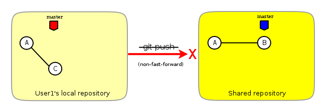

   Fig 16-1

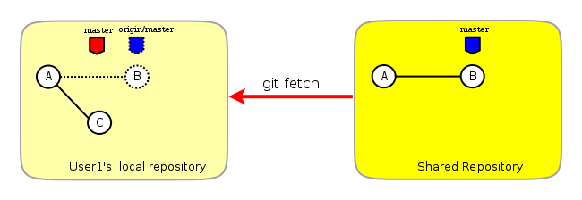

   Fig 16-2

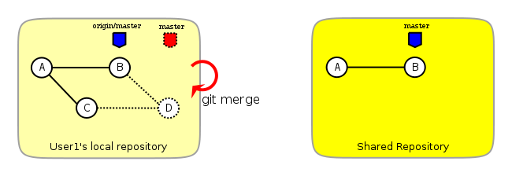

   Fig 16-3

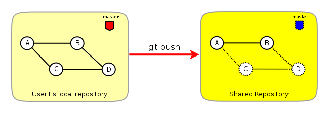

   Fig 16-4

16.2      Merge lesson 1：merge automatically     [238]
=======================================================

16.2.1      Modify different files                [238]
-------------------------------------------------------

16.2.2      Modify different location of one file [241]
-------------------------------------------------------

16.2.3      Change both file name and contents    [242]
-------------------------------------------------------

16.3      Merge lesson 2: logical conflict        [244]
=======================================================

16.4      Merge lesson 3: resolve conflict        [245]
=======================================================

16.4.1      Merge by hands                        [248]
-------------------------------------------------------

16.4.2      Resolve using GUI tools               [249]
-------------------------------------------------------

.. figure:: images/en/fig-16-05-kdiff3-1.png
   :scale: 80

   Fig 16-5

.. figure:: images/en/fig-16-06-kdiff3-2.png
   :scale: 80

   Fig 16-6

.. figure:: images/en/fig-16-07-kdiff3-3.png
   :scale: 80

   Fig 16-7

.. figure:: images/en/fig-16-08-kdiff3-4.png
   :scale: 80

   Fig 16-8

.. figure:: images/en/fig-16-09-kdiff3-5.png
   :scale: 80

   Fig 16-9

16.5      Merge lesson 4: tree conflict           [254]
=======================================================

16.5.1      Resolve tree conflict by hands        [256]
-------------------------------------------------------

16.5.2      Resolve tree conflict interactively   [257]
-------------------------------------------------------

16.6      Merge Strategy                          [259]
=======================================================

16.7      Merge related configuration             [260]
=======================================================

Chapter 17: Git Milestone
***********************************

17.1      Show milestone                          [264]
=======================================================

17.2      Create milestone                        [266]
=======================================================

17.2.1      Lightweight tag                       [267]
-------------------------------------------------------

17.2.2      Tag with notes                        [268]
-------------------------------------------------------

17.2.3      Tag with signature                    [270]
-------------------------------------------------------

17.3      Delete milestone                        [273]
=======================================================

17.4      Not change tag freely                   [274]
=======================================================

17.5      Share milestone                         [274]
=======================================================

17.6      Delete remote milestone                 [278]
=======================================================

17.7      Milestone naming rules                  [278]
=======================================================

Chapter 18: Git Branch
***********************************

18.1      Headache of branch management           [285]
=======================================================

18.1.1      Release branch                        [286]
-------------------------------------------------------

.. figure:: images/en/fig-18-01-branch-release-branch-question.png
   :scale: 70

   Fig 18-1

.. figure:: images/en/fig-18-02-branch-release-branch-answer.png
   :scale: 70

   Fig 18-2

18.1.2      Feature branch                        [288]
-------------------------------------------------------

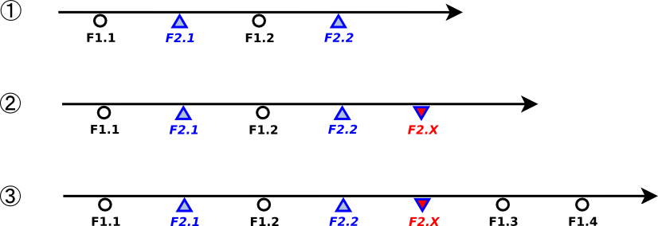

   Fig 18-1

.. figure:: images/en/fig-18-04-branch-feature-branch-answer.png
   :scale: 70

   Fig 18-4

18.1.3      Vendor branch                         [290]
-------------------------------------------------------

.. figure:: images/en/fig-18-05-branch-vendor-branch.png
   :scale: 100

   Fig 18-5

18.2      Overview of git branch command          [291]
=======================================================

18.3      Hello World Project                     [291]
=======================================================

18.4      Develop based on feature branch         [293]
=======================================================

18.4.1      Create branch: user1/getopt           [293]
-------------------------------------------------------

18.4.2      Create branch: user2/i18n             [295]
-------------------------------------------------------

.. figure:: images/en/fig-18-06-branch-i18n-initial.png
   :scale: 100

   Fig 18-6

18.4.3      Developer user1 complete              [296]
-------------------------------------------------------

18.4.4      Merge user1/getopt to master          [298]
-------------------------------------------------------

18.5      Develop based on release branch         [299]
=======================================================

18.5.1      Create release branch                 [299]
-------------------------------------------------------

18.5.2      Developer user1 works in release br.  [301]
-------------------------------------------------------

18.5.3      Developer user2 works in release br.  [302]
-------------------------------------------------------

18.5.4      Developer user2 merge and push        [303]
-------------------------------------------------------

18.5.5      Release branch fixes to master        [305]
-------------------------------------------------------

18.6      Rebase                                  [309]
=======================================================

18.6.1      Feature branch user2/i18n complete    [309]
-------------------------------------------------------

.. figure:: images/en/fig-18-07-branch-i18n-complete.png
   :scale: 100

   Fig 18-7

18.6.2      Branch user2/i18n rebase              [311]
-------------------------------------------------------

.. figure:: images/en/fig-18-08-branch-i18n-merge.png
   :scale: 100

   Fig 18-8

.. figure:: images/en/fig-18-10-branch-i18n-rebase.png
   :scale: 100

   Fig 18-10

Chapter 19: Remote repository
***********************************

19.1      Remote branch                           [320]
=======================================================

19.2      Branch tracking                         [323]
=======================================================

19.3      Remote repository                       [326]
=======================================================

19.4      PUSH, PULL with remote repository       [329]
=======================================================

19.5      Tag and remote repository               [331]
=======================================================

19.6      Branch and tag security                 [331]
=======================================================

Chapter 20: Works with patches
***********************************

20.1      Create patches                          [333]
=======================================================

20.2      Apply patches                           [335]
=======================================================

20.3      StGit and Quilt                         [337]
=======================================================

20.3.1      StGit                                 [337]
-------------------------------------------------------

20.3.2      Quilt                                 [341]
-------------------------------------------------------

Part 4: Git model
####################################

Chapter 21: Classic Git Model
***********************************

21.1      Central Cooperation Model               [343]
=======================================================

.. figure:: images/en/fig-21-01-central-model.png
   :scale: 100

   Fig 21-1

21.1.1      Work with central model               [345]
-------------------------------------------------------

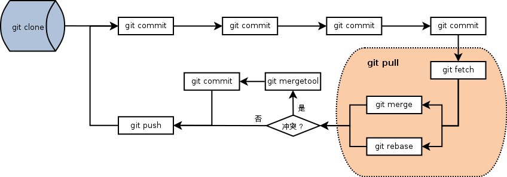

   Fig 21-2

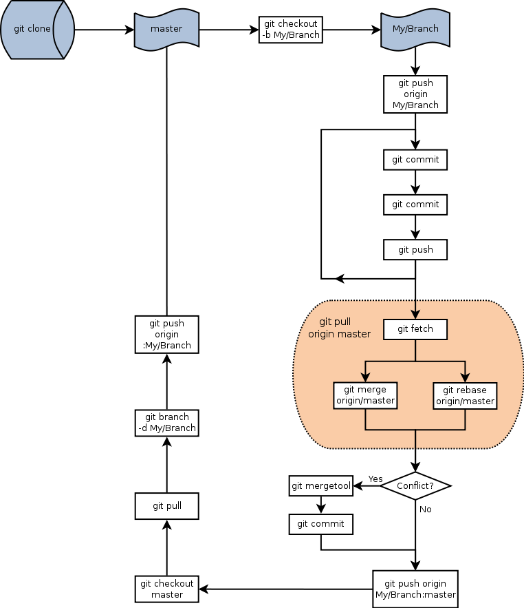

   Fig 21-3

21.1.2      Special cental model: Gerrit          [346]
-------------------------------------------------------

21.2      Pyramid Cooperation Model               [347]
=======================================================

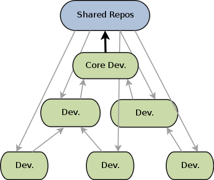

   Fig 21-4

21.2.1      Contributer open readonly repository  [348]
-------------------------------------------------------

21.2.2      Contribute using patches              [349]
-------------------------------------------------------

Chapter 22: Topgit Model
***********************************

22.1      Three SCM Milestone of Myself           [351]
=======================================================

.. figure:: images/en/fig-22-01-topgit-branch-vendor-branch.png
   :scale: 100

   Fig 22-1

22.2      Mystery of Topgit                       [353]
=======================================================

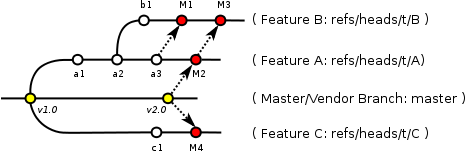

   Fig 22-2

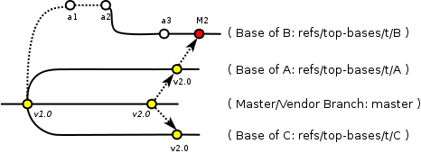

   Fig 22-3

22.3      Topgit Installation                     [354]
=======================================================

22.4      Topgit Usage                            [355]
=======================================================

22.5      Hack Topgit in Topgit way               [367]
=======================================================

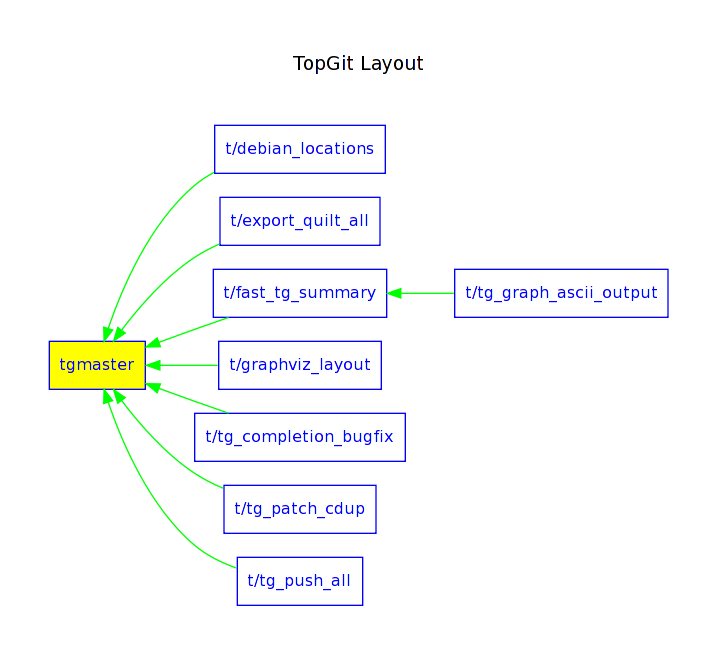

   Fig 22-5

22.6      Notes of Topgit                         [372]
=======================================================

Chapter 23: Submodule Model
***********************************

23.1      Create Submodule
=======================================================

23.2      Clone repository with submodule         [377]
=======================================================

23.3      Work inside submodule and update        [378]
=======================================================

23.4      Hidden submodule                        [381]
=======================================================

23.5      Submodule management                    [384]
=======================================================

Chapter 24: Subtree merge
***********************************

24.1      Import external repository              [386]
=======================================================

24.2      Subtree merge                           [388]
=======================================================

24.3      Track upstream with subtree merge       [391]
=======================================================

24.4      Subtree split                           [392]
=======================================================

24.5      git-subtree Plugin                      [392]
=======================================================

Chapter 25: Android Multiple repositories Cooperation
******************************************************

25.1      About repo                              [396]
=======================================================

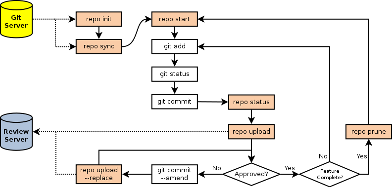

   Fig 25-1

25.2      Install repo                            [397]
=======================================================

25.3      repo and manifest initial               [398]
=======================================================

25.4      Manifest repository and manifest file   [400]
=======================================================

25.5      Sync projects                           [401]
=======================================================

25.6      Setup Android repositories mirror       [402]
=======================================================

25.7      Repo commands                           [405]
=======================================================

25.8      Repo Workflow                           [412]
=======================================================

25.9      Use repo in your project                [412]
=======================================================

25.9.1      Model 1: Repo with Gerrit             [412]
-------------------------------------------------------

25.9.2      Model 2: Repo without Gerrit          [413]
-------------------------------------------------------

25.9.3      Model 3: Improved Repo without Gerrit [414]
-------------------------------------------------------

Chapter 26: Git-SVN Model
***********************************

26.1      git-svn workflow                        [423]
=======================================================

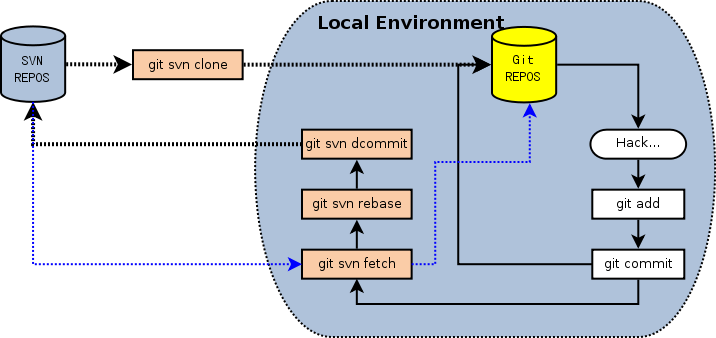

   Fig 26-1

26.2      Mystery of git-svn                      [430]
=======================================================

26.2.1      Git config and references extension   [430]
-------------------------------------------------------

26.2.2      Map between Git and SVN branches      [432]
-------------------------------------------------------

26.2.3      Other auxiliary files                 [434]
-------------------------------------------------------

26.3      Various git-svn clone methods           [434]
=======================================================

26.4      Share git-svn clone with others         [437]
=======================================================

26.5      Limitation of git-svn                   [439]
=======================================================

Part 5: Git Server
####################################

Chapter 27: Using HTTP Protocol
***********************************

27.1      Dumb HTTP protocol                      [440]
=======================================================

27.2      Smart HTTP protocol                     [443]
=======================================================

27.3      Gitweb                                  [445]
=======================================================

.. figure:: images/en/fig-27-01-gitweb-kernel-org_full.png
   :scale: 80

   Fig 27-1

27.3.1      Install Gitweb                        [445]
-------------------------------------------------------

27.3.2      Gitweb configuration                  [446]
-------------------------------------------------------

27.3.3      Repository settings for Gitweb        [447]
-------------------------------------------------------

Chapter 28: Using Git Protocol
***********************************

28.1      Git protocol                            [449]
=======================================================

28.2      Run Git protocol using inetd            [449]
=======================================================

28.3      Run Git protocol using runit            [450]
=======================================================

Chapter 29: Using SSH Protocol
***********************************

29.1      SSH protocol                            [452]
=======================================================

29.2      SSH services seteup comparation         [452]
=======================================================

29.3      SSH public key authentication           [454]
=======================================================

29.4      SSH host configuration                  [455]
=======================================================

Chapter 30: Gitolite
***********************************

30.1      Install Gitolite                        [458]
=======================================================

30.1.1      Create special account on server      [458]
-------------------------------------------------------

30.1.2      Gitolite Install and upgrade          [459]
-------------------------------------------------------

30.1.3      About SSH host alias                  [462]
-------------------------------------------------------

30.1.4      Other install methods                 [463]
-------------------------------------------------------

30.2      Gitolite Admin                          [464]
=======================================================

30.2.1      Clone gitolite-admin repository       [464]
-------------------------------------------------------

30.2.2      Add new users                         [465]
-------------------------------------------------------

30.2.3      Authorizations                        [467]
-------------------------------------------------------

30.3      Gitolite authorization detail           [468]
=======================================================

30.3.1      Authorization rules                   [468]
-------------------------------------------------------

30.3.2      Define user and repository groups     [469]
-------------------------------------------------------

30.3.3      Repository ACL                        [470]
-------------------------------------------------------

30.3.4      Gitolite implementation               [472]
-------------------------------------------------------

30.4      Repository authorization cases          [473]
=======================================================

30.4.1      Authorize for whole repository        [473]
-------------------------------------------------------

30.4.2      Authorize for wildcard repository     [474]
-------------------------------------------------------

30.4.3      Users owned repository                [475]
-------------------------------------------------------

30.4.4      Auth for refs: classic model          [476]
-------------------------------------------------------

30.4.5      Auth for refs: extension model        [477]
-------------------------------------------------------

30.4.6      Auth for refs: deny rules             [478]
-------------------------------------------------------

30.4.7      Branch in user namespace              [478]
-------------------------------------------------------

30.4.8      Authorization for path based write    [479]
-------------------------------------------------------

30.5      Create new repository                   [479]
=======================================================

30.5.1      Create after update admin repository  [480]
-------------------------------------------------------

30.5.2      Push to create                        [481]
-------------------------------------------------------

30.5.3      Create directly on server             [482]
-------------------------------------------------------

30.6      Gitolite Hacks                          [483]
=======================================================

30.7      Other Gitolite features                 [483]
=======================================================

30.7.1      Repositories mirror                   [483]
-------------------------------------------------------

30.7.2      Gitweb and Git daemon integration     [486]
-------------------------------------------------------

30.7.3      Other features and references         [487]
-------------------------------------------------------

Chapter 31: Gitosis
***********************************

31.1      Install Gitosis                         [490]
=======================================================

31.1.1      Installation                          [490]
-------------------------------------------------------

31.1.2      Setup special user account            [491]
-------------------------------------------------------

31.1.3      Initial Gitosis serivces              [491]
-------------------------------------------------------

31.2      Gitosis administration                  [492]
=======================================================

31.2.1      Clone gitolit-admin repository        [492]
-------------------------------------------------------

31.2.2      Add new user                          [493]
-------------------------------------------------------

31.2.3      Authorizations                        [494]
-------------------------------------------------------

31.3      Gitosis authorization detail            [495]
=======================================================

31.3.1      Gitosis default configrations         [495]
-------------------------------------------------------

31.3.2      Adminstration of gitosis-admin repos  [496]
-------------------------------------------------------

31.3.3      Define user groups and authoriztions  [496]
-------------------------------------------------------

31.3.4      Gitweb integration                    [498]
-------------------------------------------------------

31.4      Create new repository                   [498]
=======================================================

31.5      Light-weight service setup              [499]
=======================================================

Chapter 32: Gerrit
***********************************

32.1      Mystery of Gerrit                       [502]
=======================================================

.. figure:: images/en/fig-32-01-gerrit-workflow.png
   :scale: 60

   Fig 32-1

32.2      Setup Gerrit server                     [506]
=======================================================

32.3      Gerrit configurations                   [512]
=======================================================

32.4      Access Gerrit database                  [513]
=======================================================

32.5      Register as Gerrit administrator        [515]
=======================================================

32.6      Access SSH admin interface              [518]
=======================================================

32.7      Setup new project                       [520]
=======================================================

32.8      Import Git repository                   [524]
=======================================================

32.9      Setup review workflow                   [526]
=======================================================

32.10        Work with Gerrit                     [529]
=======================================================

32.10.1    Developer works in local repos         [530]
-------------------------------------------------------

32.10.2    Push to Gerrit server                  [531]
-------------------------------------------------------

32.10.3    Review new submit changeset            [531]
-------------------------------------------------------

32.10.4    Review task tests failed               [534]
-------------------------------------------------------

32.10.5    Resend review task                     [536]
-------------------------------------------------------

32.10.6    New review changeset tests passed      [537]
-------------------------------------------------------

.. figure:: images/en/fig-32-28-gerrit-review-9-review-patchset-merged.png
   :scale: 80

   Fig 32-28: review task after publish

32.10.7    Update from remote server              [539]
-------------------------------------------------------

32.11        More Gerrit references               [540]
=======================================================

Chapter 33: Git Hosting
***********************************

33.1      Github                                  [541]
=======================================================

33.2      Gitorious                               [543]
=======================================================

Part 6: Migrate to Git
####################################

Chapter 34: CVS to Git
***********************************

34.1      Install cvs2svn（including cvs2git）    [546]
=======================================================

34.1.1      Install cvs2svn under Linux           [546]
-------------------------------------------------------

34.1.2      Install cvs2svn under Mac OS X        [547]
-------------------------------------------------------

34.2      Preparations for repository migration   [547]
=======================================================

34.3      Repository migration                    [550]
=======================================================

34.4      Postcheck after migration               [555]
=======================================================

Chapter 35: Others SCM Migration
***********************************

35.1      SVN to Git                              [557]
=======================================================

35.2      Hg to Git                               [558]
=======================================================

35.3      Git fast-import                         [561]
=======================================================

35.4      Git repository refactor                 [567]
=======================================================

35.4.1      Environment filter                    [569]
-------------------------------------------------------

35.4.2      Tree filter                           [570]
-------------------------------------------------------

35.4.3      Index filter                          [570]
-------------------------------------------------------

35.4.4      Parent filter                         [570]
-------------------------------------------------------

35.4.5      Message filter                        [571]
-------------------------------------------------------

35.4.6      Commit filter                         [571]
-------------------------------------------------------

35.4.7      Tag name filter                       [573]
-------------------------------------------------------

35.4.8      Subdirectory filter                   [573]
-------------------------------------------------------

Part 7: Git Other Usage
####################################

Chapter 36: etckeeper
***********************************

36.1      Install etckeeper                       [575]
=======================================================

36.2      Configure etckeeper                     [575]
=======================================================

36.3      Use etckeeper                           [576]
=======================================================

Chapter 37: Gistore
***********************************

37.1      Install Gistore                         [577]
=======================================================

37.1.1      Install Gistore from source           [577]
-------------------------------------------------------

37.1.2      Install Gistore using easy_install    [578]
-------------------------------------------------------

37.2      Use Gistore                             [579]
=======================================================

37.2.1      Create backup repository              [580]
-------------------------------------------------------

37.2.2      Gistore configuration                 [580]
-------------------------------------------------------

37.2.3      Gistore backup item management        [582]
-------------------------------------------------------

37.2.4      Run backup task                       [583]
-------------------------------------------------------

37.2.5      View backup log                       [583]
-------------------------------------------------------

37.2.6      View and restore backup database      [585]
-------------------------------------------------------

37.2.7      Backup rollback and settings          [586]
-------------------------------------------------------

37.2.8      Register backup task alias            [588]
-------------------------------------------------------

37.2.9      Backup using crontab                  [588]
-------------------------------------------------------

37.3      Mirroring Gistore backup repository     [589]
=======================================================

Chapter 38: Patch file binary extension
************************************************

38.1      Binary support for Git repository       [590]
=======================================================

38.2      Binary support for common directory     [594]
=======================================================

38.3      Git style diff support in other tools   [596]
=======================================================

Chapter 39: Cloud storage
***********************************

39.1      Current cloud storage problem           [598]
=======================================================

39.2      Features of Git style cloud storage     [599]
=======================================================

Part 8: MISC
####################################

Chapter 40: Cross OS Git operation
***********************************

.. figure:: images/en/fig-40-1-git-survs-os.png
   :scale: 80

   Fig 40-1

40.1      Character set problems                  [602]
=======================================================

40.2      Filename Case sensitive and insens.     [603]
=======================================================

40.3      End of line problems                    [604]
=======================================================

Chapter 41: Git special features
***********************************

41.1      Attributes                              [609]
=======================================================

41.1.1      Attributes defination                 [609]
-------------------------------------------------------

41.1.2      Attribute files and file priority     [610]
-------------------------------------------------------

41.1.3      Common attributes                     [612]
-------------------------------------------------------

41.2      Hooks and templates                     [619]
=======================================================

41.2.1      Git hooks                             [619]
-------------------------------------------------------

41.2.2      Git templates                         [625]
-------------------------------------------------------

41.3      Sparse checkout and shallow clone       [626]
=======================================================

41.3.1      Sparse checkout                       [626]
-------------------------------------------------------

41.3.2      Shallow clone                         [629]
-------------------------------------------------------

41.4      Grafts and replace                      [631]
=======================================================

41.4.1      Git grafts                            [631]
-------------------------------------------------------

41.4.2      Git replace                           [632]
-------------------------------------------------------

41.5      Git Notes                               [633]
=======================================================

41.5.1      Mystery of git notes                  [634]
-------------------------------------------------------

41.5.2      Git notes subcommands                 [637]
-------------------------------------------------------

41.5.3      Git notes related configuration       [638]
-------------------------------------------------------

.. figure:: images/en/fig-41-1-github-notes.png
   :scale: 70

   Fig 41-1

Part 9: Appendix
####################################

Git Commands Index
************************

Git and CVS, face to face
******************************

Git and SVN, face to face
******************************

Git and Hg, face to face
******************************
